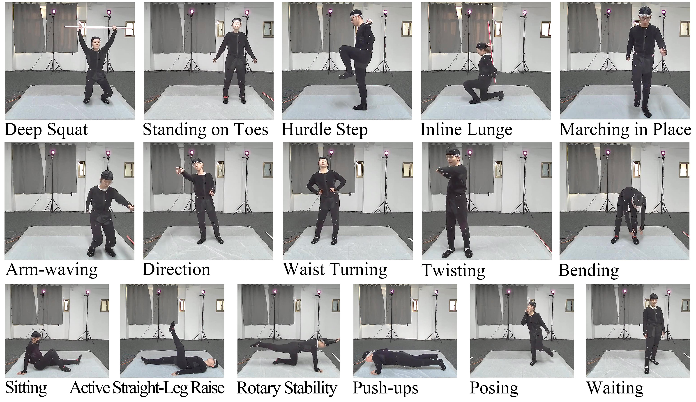

# PVM Dataset


## Introduction
The PVM (Pressure, Vision, Mocap) dataset is a large-scale multimodal human activity dataset, comprising 16 actions performed by 20 participants. The body mass index (BMI) of the 20 participants (10 males and 10 females, average age = 22.9, SD = 2.86) ranged from 18 to 28, ensuring a moderate amount of body shape variability and different ranges of mobility among them. In the dataset, it includes ground pressure images, monocular images, 2D poses extracted from monocular images, and ground truth 3D poses, collected using a pressure mat, a monocular camera, and a optical motion capture system, respectively. Finally, the PVM dataset contains over 600,000 frames of data in total.




## Download link
In the download links below, we provide all the pressure images, 2D poses and ground truth 3D poses of the PVM dataset (PVMDataset.zip), as well as monocular images of two participants in the test set (monocular_images_tiny.zip). The data in these two compressed packages are stored frame by frame. Among them, data in PVMDataset.zip is stored in the form of .npz, and each frame of .npz contains a pressure image, a 2D pose and a ground truth 3D pose with key names of pressure, pose2d and pose3d respectively. For details, please refer to the file tree below.

[PVMDataset.zip](https://drive.google.com/file/d/1HZmRqaLhOtv1KyWZsGBoodlY6B5Qutps/view?usp=sharing)

[monocular_images_tiny.zip](https://drive.google.com/file/d/1syo4noM6DbotgNJjrNyEl2fARijZTzls/view?usp=sharing)


## File Tree

```
|-- PVMDataset
| |-- P1
| |      Active Straight-Leg Raise_0.npz
| |      Active Straight-Leg Raise_1.npz
| |      Active Straight-Leg Raise_2.npz
| |      ...
| |      walking(stable)_1362.npz
| |-- P2
| |      Active Straight-Leg Raise_0.npz
| |      Active Straight-Leg Raise_1.npz
| |      Active Straight-Leg Raise_2.npz
| |      ...
| |      walking(stable)_1362.npz
| |-- P3
| |      Active Straight-Leg Raise_0.npz
| |      Active Straight-Leg Raise_1.npz
| |      Active Straight-Leg Raise_2.npz
| |      ...
| |      walking(stable)_1362.npz
| |-- P4
| |      Active Straight-Leg Raise_0.npz
| |      Active Straight-Leg Raise_1.npz
| |      Active Straight-Leg Raise_2.npz
| |      ...
| |      walking(stable)_1362.npz
| |-- P5
| |      Active Straight-Leg Raise_0.npz
| |      Active Straight-Leg Raise_1.npz
| |      Active Straight-Leg Raise_2.npz
| |      ...
| |      walking(stable)_1362.npz
| |-- P6
| |      Active Straight-Leg Raise_0.npz
| |      Active Straight-Leg Raise_1.npz
| |      Active Straight-Leg Raise_2.npz
| |      ...
| |      walking(stable)_1362.npz
| |-- P7
| |      Active Straight-Leg Raise_0.npz
| |      Active Straight-Leg Raise_1.npz
| |      Active Straight-Leg Raise_2.npz
| |      ...
| |      walking(stable)_1362.npz
| |-- P8
| |      Active Straight-Leg Raise_0.npz
| |      Active Straight-Leg Raise_1.npz
| |      Active Straight-Leg Raise_2.npz
| |      ...
| |      walking(stable)_1362.npz
| |-- P9
| |      Active Straight-Leg Raise_0.npz
| |      Active Straight-Leg Raise_1.npz
| |      Active Straight-Leg Raise_2.npz
| |      ...
| |      walking(stable)_1362.npz
| |-- P10
| |      Active Straight-Leg Raise_0.npz
| |      Active Straight-Leg Raise_1.npz
| |      Active Straight-Leg Raise_2.npz
| |      ...
| |      walking(stable)_1362.npz
| |-- P11
| |      Active Straight-Leg Raise_0.npz
| |      Active Straight-Leg Raise_1.npz
| |      Active Straight-Leg Raise_2.npz
| |      ...
| |      walking(stable)_1362.npz
| |-- P12
| |      Active Straight-Leg Raise_0.npz
| |      Active Straight-Leg Raise_1.npz
| |      Active Straight-Leg Raise_2.npz
| |      ...
| |      walking(stable)_1362.npz
| |-- P13
| |      Active Straight-Leg Raise_0.npz
| |      Active Straight-Leg Raise_1.npz
| |      Active Straight-Leg Raise_2.npz
| |      ...
| |      walking(stable)_1362.npz
| |-- P14
| |      Active Straight-Leg Raise_0.npz
| |      Active Straight-Leg Raise_1.npz
| |      Active Straight-Leg Raise_2.npz
| |      ...
| |      walking(stable)_1362.npz
| |-- P15
| |      Active Straight-Leg Raise_0.npz
| |      Active Straight-Leg Raise_1.npz
| |      Active Straight-Leg Raise_2.npz
| |      ...
| |      walking(stable)_1362.npz
| |-- P16
| |      Active Straight-Leg Raise_0.npz
| |      Active Straight-Leg Raise_1.npz
| |      Active Straight-Leg Raise_2.npz
| |      ...
| |      walking(stable)_1362.jpg
| |-- P17
| |      Active Straight-Leg Raise_0.npz
| |      Active Straight-Leg Raise_1.npz
| |      Active Straight-Leg Raise_2.npz
| |      ...
| |      walking(stable)_1362.jpg
| |-- P18
| |      Active Straight-Leg Raise_0.npz
| |      Active Straight-Leg Raise_1.npz
| |      Active Straight-Leg Raise_2.npz
| |      ...
| |      walking(stable)_1362.jpg
| |-- P19
| |      Active Straight-Leg Raise_0.npz
| |      Active Straight-Leg Raise_1.npz
| |      Active Straight-Leg Raise_2.npz
| |      ...
| |      walking(stable)_1362.jpg
| |-- P20
| |      Active Straight-Leg Raise_0.npz
| |      Active Straight-Leg Raise_1.npz
| |      Active Straight-Leg Raise_2.npz
| |      ...
| |      walking(stable)_1362.jpg
```

```
monocular_images_tiny
|── P13
|   ├── Active Straight-Leg Raise
│       ├── Active Straight-Leg Raise_0.jpg
│       ├── Active Straight-Leg Raise_1.jpg
│       ├── Active Straight-Leg Raise_2.jpg
│       ├── ...
│       ├── Active Straight-Leg Raise_2221.jpg
│       ├── Active Straight-Leg Raise_2222.jpg
│       └── Active Straight-Leg Raise_2223.jpg
|   ├── arm-waving
│       ├── arm-waving_0.jpg
│       ├── arm-waving_1.jpg
│       ├── arm-waving_2.jpg
│       ├── ...
│       ├── arm-waving_1951.jpg
│       ├── arm-waving_1952.jpg
│       └── arm-waving_1953.jpg
|   ├── bending
│       ├── bending_0.jpg
│       ├── bending_1.jpg
│       ├── bending_2.jpg
│       ├── ...
│       ├── bending_1954.jpg
│       ├── bending_1955.jpg
│       └── bending_1956.jpg
|   ├── deep squat
│       ├── deep squat_0.jpg
│       ├── deep squat_1.jpg
│       ├── deep squat_2.jpg
│       ├── ...
│       ├── deep squat_1659.jpg
│       ├── deep squat_1660.jpg
│       └── deep squat_1661.jpg
|   ├── hand movements
│       ├── hand movements_0.jpg
│       ├── hand movements_1.jpg
│       ├── hand movements_2.jpg
│       ├── ...
│       ├── hand movements_2479.jpg
│       ├── hand movements_2480.jpg
│       └── hand movements_2481.jpg
|   ├── hurdle step
│       ├── hurdle step_0.jpg
│       ├── hurdle step_1.jpg
│       ├── hurdle step_2.jpg
│       ├── ...
│       ├── hurdle step_2155.jpg
│       ├── hurdle step_2156.jpg
│       └── hurdle step_2157.jpg
|   ├── inline lunge
│       ├── inline lunge_0.jpg
│       ├── inline lunge_1.jpg
│       ├── inline lunge_2.jpg
│       ├── ...
│       ├── inline lunge_1887.jpg
│       ├── inline lunge_1888.jpg
│       └── inline lunge_1889.jpg
|   ├── posing
│       ├── posing_0.jpg
│       ├── posing_1.jpg
│       ├── posing_2.jpg
│       ├── ...
│       ├── posing_1464.jpg
│       ├── posing_1465.jpg
│       └── posing_1466.jpg
|   ├── push-ups
│       ├── push-ups_0.jpg
│       ├── push-ups_1.jpg
│       ├── push-ups_2.jpg
│       ├── ...
│       ├── push-ups_872.jpg
│       ├── push-ups_873.jpg
│       └── push-ups_874.jpg
|   ├── Rotary Stability
│       ├── Rotary Stability_0.jpg
│       ├── Rotary Stability_1.jpg
│       ├── Rotary Stability_2.jpg
│       ├── ...
│       ├── Rotary Stability_1856.jpg
│       ├── Rotary Stability_1857.jpg
│       └── Rotary Stability_1858.jpg
|   ├── sitting
│       ├── sitting_0.jpg
│       ├── sitting_1.jpg
│       ├── sitting_2.jpg
│       ├── ...
│       ├── sitting_1881.jpg
│       ├── sitting_1882.jpg
│       └── sitting_1883.jpg
|   ├── standing on toes
│       ├── standing on toes_0.jpg
│       ├── standing on toes_1.jpg
│       ├── standing on toes_2.jpg
│       ├── ...
│       ├── standing on toes_1838.jpg
│       ├── standing on toes_1839.jpg
│       └── standing on toes_1840.jpg
|   ├── twisting
│       ├── twisting_0.jpg
│       ├── twisting_1.jpg
│       ├── twisting_2.jpg
│       ├── ...
│       ├── twisting_1817.jpg
│       ├── twisting_1818.jpg
│       └── twisting_1819.jpg
|   ├── waist turning
│       ├── waist turning_0.jpg
│       ├── waist turning_1.jpg
│       ├── waist turning_2.jpg
│       ├── ...
│       ├── waist turning_1872.jpg
│       ├── waist turning_1873.jpg
│       └── waist turning_1874.jpg
|   ├── waiting
│       ├── waiting_0.jpg
│       ├── waiting_1.jpg
│       ├── waiting_2.jpg
│       ├── ...
│       ├── waiting_1885.jpg
│       ├── waiting_1886.jpg
│       └── waiting_1887.jpg
│   ├──walking(stable)
│       ├── walking(stable)_0.jpg
│       ├── walking(stable)_1.jpg
│       ├── walking(stable)_2.jpg
│       ├── ...
│       ├── walking(stable)_1361.jpg
│       ├── walking(stable)_1362.jpg
│       └── walking(stable)_1363.jpg
|── P4
|   ├── Active Straight-Leg Raise
│       ├── Active Straight-Leg Raise_0.jpg
│       ├── Active Straight-Leg Raise_1.jpg
│       ├── Active Straight-Leg Raise_2.jpg
│       ├── ...
│       ├── Active Straight-Leg Raise_2186.jpg
│       ├── Active Straight-Leg Raise_2187.jpg
│       └── Active Straight-Leg Raise_2188.jpg
|    ├── arm-waving
│       ├── arm-waving_0.jpg
│       ├── arm-waving_1.jpg
│       ├── arm-waving_2.jpg
|       ├── ...
|       ├── arm-waving_1897.jpg
|       ├── arm-waving_1898.jpg
│       └── arm-waving_1899.jpg
|   ├── bending
|       ├── bending_0.jpg
|       ├── bending_1.jpg
|       ├── bending_2.jpg
|       ├── ...
|       ├── bending_1863.jpg
|       ├── bending_1864.jpg
│       └── bending_1865.jpg
|   ├── deep squat
|       ├── deep squat_0.jpg
|       ├── deep squat_1.jpg
|       ├── deep squat_2.jpg
|       ├── ...
|       ├── deep squat_1934.jpg
|       ├── deep squat_1935.jpg
│       └── deep squat_1936.jpg
|   ├── hand movements
|       ├── hand movements_0.jpg
|       ├── hand movements_1.jpg
|       ├── hand movements_2.jpg
|       ├── ...
|       ├── hand movements_3200.jpg
|       ├── hand movements_3201.jpg
│       └── hand movements_3202.jpg
|    ├── hurdle step
|       ├── hurdle step_0.jpg
|       ├── hurdle step_1.jpg
|       ├── hurdle step_2.jpg
|       ├── ...
|       ├── hurdle step_1671.jpg
|       ├── hurdle step_1672.jpg
│       └── hurdle step_1673.jpg
|    ├── inline lunge
|       ├── inline lunge_0.jpg
|       ├── inline lunge_1.jpg
|       ├── inline lunge_2.jpg
|       ├── ...
|       ├── inline lunge_1900.jpg
|       ├── inline lunge_1901.jpg
│       └── inline lunge_1902.jpg
|    ├── posing
|       ├── posing_0.jpg
|       ├── posing_1.jpg
|       ├── posing_2.jpg
|       ├── ...
|       ├── posing_1855.jpg
|       ├── posing_1856.jpg
│       └── posing_1857.jpg
|    ├── push-ups
|       ├── push-ups_0.jpg
|       ├── push-ups_1.jpg
|       ├── push-ups_2.jpg
|       ├── ...
|       ├── push-ups_1772.jpg
|       ├── push-ups_1773.jpg
│       └── push-ups_1774.jpg
|    ├── Rotary Stability
|       ├── Rotary Stability_0.jpg
|       ├── Rotary Stability_1.jpg
|       ├── Rotary Stability_2.jpg
|       ├── ...
|       ├── Rotary Stability_2087.jpg
|       ├── Rotary Stability_2088.jpg
│       └── Rotary Stability_2089.jpg
|    ├── sitting
|       ├── sitting_0.jpg
|       ├── sitting_1.jpg
|       ├── sitting_2.jpg
|       ├── ...
|       ├── sitting_2249.jpg
|       ├── sitting_2250.jpg
│       └── sitting_2251.jpg
|    ├──standing on toes
|       ├── standing on toes_0.jpg
|       ├── standing on toes_1.jpg
|       ├── standing on toes_2.jpg
|       ├── ...
|       ├── standing on toes_1907.jpg
|       ├── standing on toes_1908.jpg
│       └── standing on toes_1909.jpg
|    ├──twisting
|       ├── twisting_0.jpg
|       ├── twisting_1.jpg
|       ├── twisting_2.jpg
|       ├── ...
|       ├── twisting_1943.jpg
|       ├── twisting_1944.jpg
│       └── twisting_1945.jpg
|    ├── waist turning
|       ├── waist turning_0.jpg
|       ├── waist turning_1.jpg
|       ├── waist turning_2.jpg
|       ├── ...
|       ├── waist turning_1958.jpg
|       ├── waist turning_1959.jpg
│       └── waist turning_1960.jpg
|    ├── waiting
|       ├── waiting_0.jpg
|       ├── waiting_1.jpg
|       ├── waiting_2.jpg
|       ├── ...
|       ├── waiting_2124.jpg
|       ├── waiting_2125.jpg
│       └── waiting_2126.jpg
└────├──walking(stable)
        ├── walking(stable)_0.jpg
        ├── walking(stable)_1.jpg
        ├── walking(stable)_2.jpg
        ├── ...
        ├── walking(stable)_1420.jpg
        ├── walking(stable)_1421.jpg
        └── walking(stable)_1422.jpg
```
